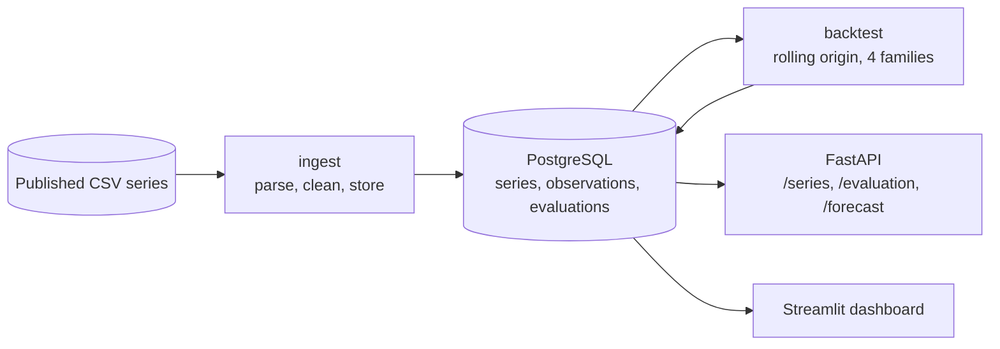

## Series

Five published series with different structure, stored in PostgreSQL alongside the
parameters used to model each one.

| Series | Observations | Frequency | Cycle | Horizon |
|---|---:|---|---:|---:|
| Airline passengers | 144 | monthly | 12 | 12 |
| Monthly car sales | 108 | monthly | 12 | 12 |
| Monthly sunspots | 600 | monthly | 1 | 12 |
| Daily minimum temperatures | 1,460 | daily | 365 | 28 |
| Daily female births | 365 | daily | 7 | 14 |

The sunspot series is modelled as non-seasonal because its cycle runs about 132
months, which no seasonal term in this configuration can represent.

## Evaluation method

Four model families are evaluated against each series: a seasonal naive baseline,
Prophet, SARIMA from statsmodels, and LightGBM over lag and calendar features.
All four implement the same interface and return a point forecast with an 80%
prediction interval, so the same scoring applies to each.

Evaluation uses rolling-origin cross-validation. Each fold advances the training
cutoff by one horizon and refits every model, producing four measurements per
model and series, or 80 fits in total.

MAPE is not reported. The series span four orders of magnitude, from single-digit
temperatures to car sales in the tens of thousands, and two of them contain values
below 1.0: sunspots reach 0.20 and temperatures 0.50. A five-unit error against an
observation of 0.20 registers as 2,500%, which would dominate any average
containing it. MASE divides the mean absolute error by the in-sample mean absolute
error of the seasonal naive, giving a scale-free figure where 1.0 matches the
baseline.

## Results

Lowest mean MASE per series across four folds:

| Series | Selected model | MASE | Coverage |
|---|---|---:|---:|
| Daily minimum temperatures | prophet | 0.688 | 75% |
| Daily female births | prophet | 0.779 | 79% |
| Airline passengers | sarima | 0.794 | 67% |
| Monthly car sales | seasonal_naive | 0.999 | 100% |
| Monthly sunspots | lightgbm | 2.041 | 35% |

Three families win across five series, and on one of them no family beats the
baseline.

### Car sales

On this series no family improves on the seasonal naive:

| Model | MASE | MAE |
|---|---:|---:|
| **seasonal_naive** | **0.999** | **1,584.98** |
| prophet | 1.114 | 1,778.63 |
| lightgbm | 1.130 | 1,801.69 |
| sarima | 1.306 | 2,086.20 |

Measured on the final twelve months alone the ordering inverts: Prophet leads at
0.866 and the seasonal naive comes last at 1.270. Averaging over four folds is what
separates a model from a favourable window.

### Interval calibration

Nominal interval width is 80%. Observed coverage across models and series:

| Model | Coverage range |
|---|---|
| sarima | 56% to 80% |
| seasonal_naive | 71% to 100% |
| prophet | 40% to 80% |
| lightgbm | 35% to 55% |

LightGBM under-covers on every series. Its intervals come from quantile regression
at 0.1 and 0.9 evaluated at each recursive step, and that procedure does not
accumulate the uncertainty introduced by feeding predicted values back into the lag
features. SARIMA, whose intervals derive from the state-space model variance,
tracks the nominal level most closely.

## Architecture

Ingestion and backtesting run as a batch job that writes to the database. The
dashboard and the API read from it. Series metadata travels with the stored series
rather than being read from the source registry at serving time, so both consumers
depend on the database alone.

## Testing

60 tests at 95% coverage of the application packages. The suite runs offline:
series are read from fixtures rather than downloaded, models are fitted on a
60-point synthetic series, and the database is a temporary SQLite file. CI
additionally applies the migrations against a PostgreSQL service container.
